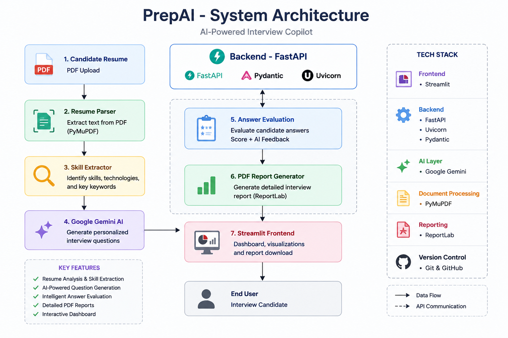
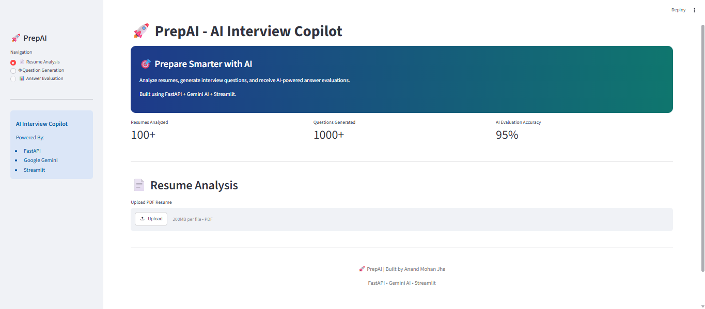
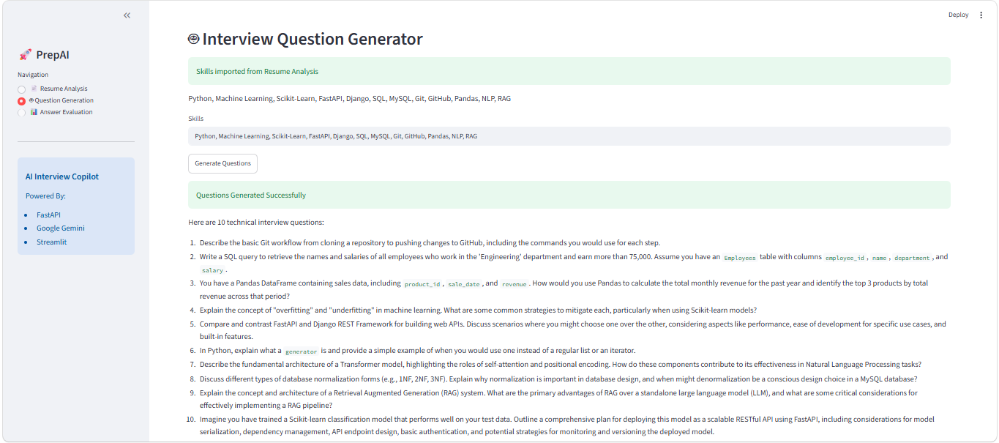
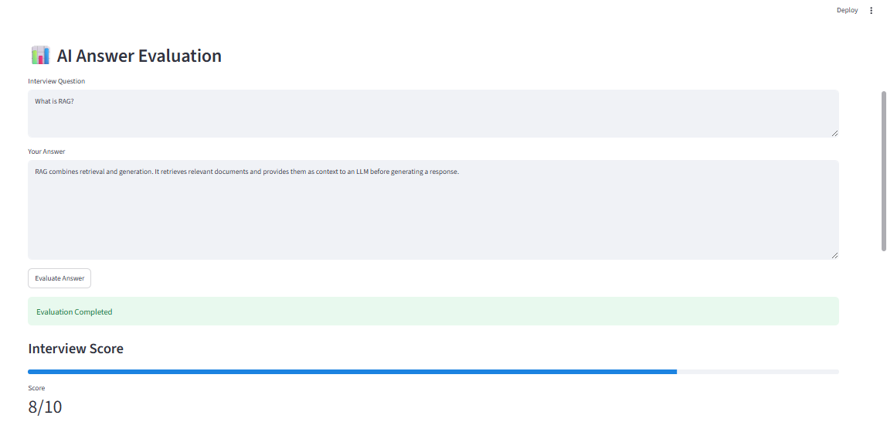
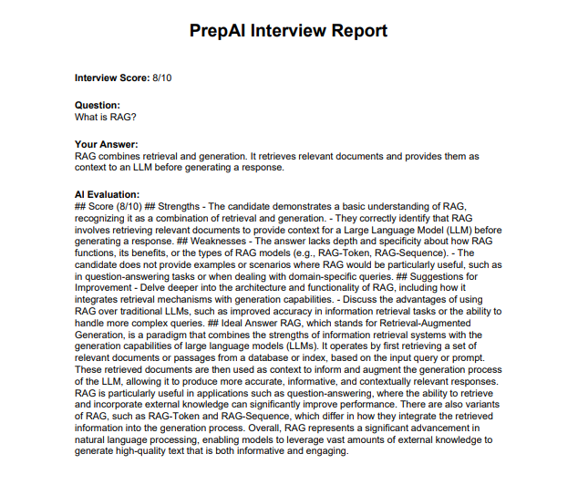

# 🚀 PrepAI - AI Interview Copilot

AI-powered interview preparation platform that analyzes resumes, generates technical interview questions, evaluates answers, and creates detailed PDF reports.

---

## 📌 Features

### 📄 Resume Analysis

- Upload PDF resumes
- Extract resume content
- Detect technical skills automatically
- Analyze candidate profile

### ❓ AI Question Generation

- Generate interview questions based on extracted skills
- Beginner, Intermediate, and Advanced level questions
- Domain-specific technical questions

### 🎯 Answer Evaluation

- AI-powered answer assessment
- Score answers out of 10
- Detailed feedback
- Ideal answer generation

### 📑 PDF Report Generation

- Download interview evaluation reports
- Includes score, feedback, and recommendations

---

## 🏗️ Architecture



---

## 📸 Application Screenshots

### 🏠 Home Dashboard



---

### 📄 Resume_Analysis


---

### ❓ Question Generation



---

### 🎯 AI Answer Evaluation



---

### 📑 PDF Report



---

## 🛠️ Tech Stack

### Backend

- FastAPI
- Python
- Google Gemini API
- Groq API (Fallback)
- Uvicorn

### Frontend

- Streamlit

### PDF Generation

- ReportLab

### Deployment

- Streamlit Cloud
- Render / Railway

---

## 📂 Project Structure

```text
PrepAI
│
├── backend
│   ├── app
│   │   ├── api
│   │   ├── services
│   │   └── main.py
│   │
│   └── requirements.txt
│
├── frontend
│   ├── streamlit_app.py
│   └── requirements.txt
│
├── docs
│   ├── architecture.png
│   ├── home.png
│   ├── resume-analysis.png
│   ├── question-generation.png
│   ├── evaluation.png
│   └── pdf-report.png
│
└── README.md
```

---

## ⚙️ Installation

### Clone Repository

```bash
git clone https://github.com/githuanand/prepai-ai-interview-copilot.git
cd prepai-ai-interview-copilot
```

### Backend Setup

```bash
cd backend

python -m venv venv

venv\Scripts\activate

pip install -r requirements.txt
```

Create `.env`

```env
GEMINI_API_KEY=YOUR_API_KEY
GROQ_API_KEY=YOUR_API_KEY
```

Run Backend

```bash
uvicorn app.main:app --reload
```

---

### Frontend Setup

```bash
cd frontend

pip install -r requirements.txt

streamlit run app.py
```

---

## 📡 API Endpoints

### Resume Upload

```http
POST /upload-resume
```

### Generate Questions

```http
POST /generate-questions
```

### Evaluate Answer

```http
POST /evaluate-answer
```

### Health Check

```http
GET /
```

---

## 👨‍💻 Author

### Anand Mohan Jha

- AI/ML Engineer
- Data Scientist
- FastAPI Developer
- Generative AI Enthusiast

GitHub:
https://github.com/githuanand

---

## ⭐ Support

If you found this project useful, consider giving it a star ⭐